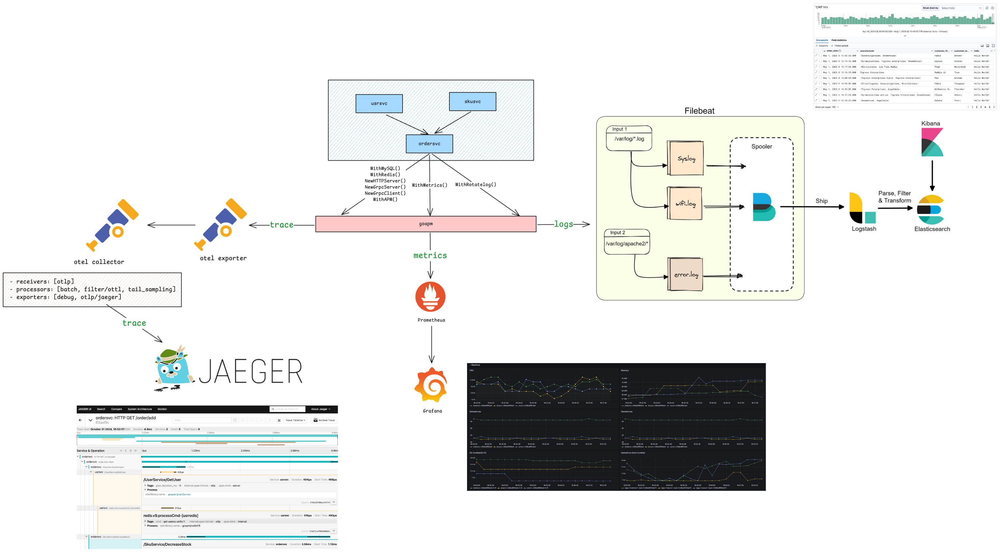
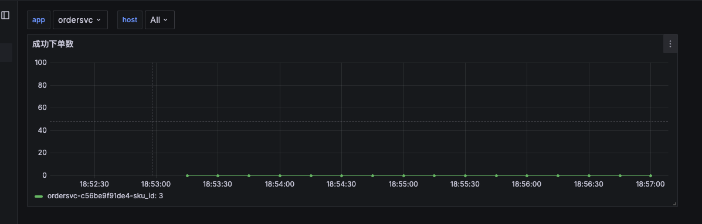
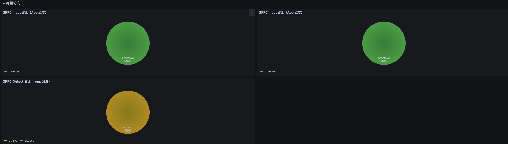
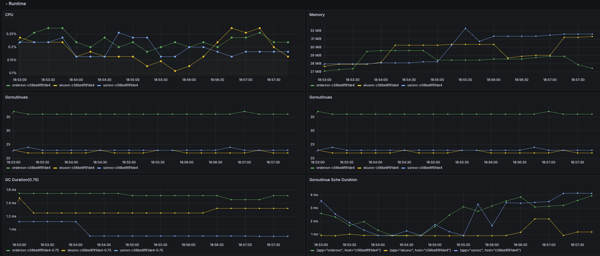
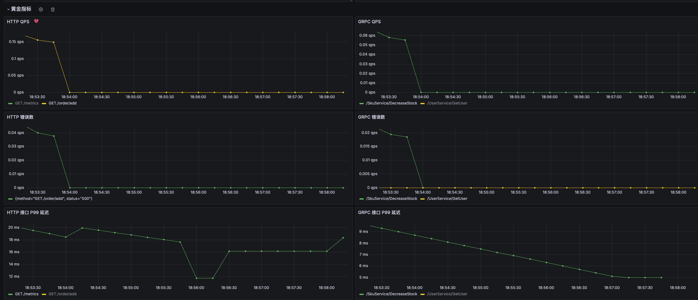
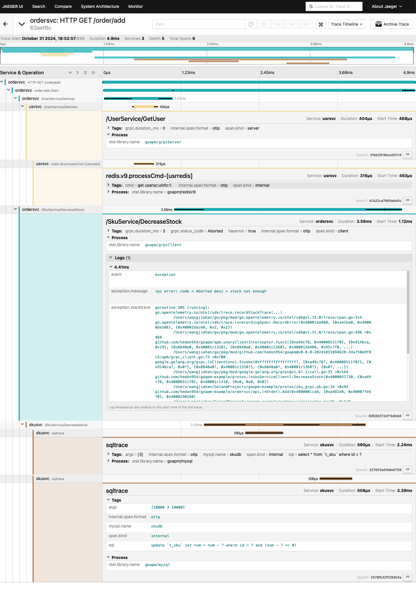
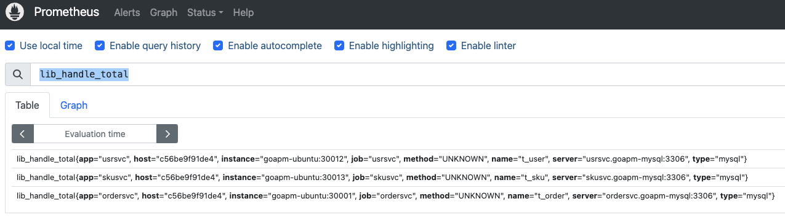

# goapm-example

`goapm-example` is a simple example for [goapm](https://github.com/hedon954/goapm).

## Architecture



## Requirements

- `Go`: 1.23.2 or later
- `Docker` installed
- `Make` installed
- Make sure the following ports are not occupied
  - `30001`/`30002`/`30003`/`30004`/`30012`/`30013`: `order`/`user`/`sku` service
  - `1888`/`8888`/`8889`/`13133`/`4317`/`4318`/`55678`: `otel-collector`
  - `3306`: `MySQL`
  - `6379`: `Redis`
  - `16686`/`14268`/`14250`: `Jaeger`
  - `3000`: `Grafana`
  - `9090`: `Prometheus`
  - `5601`: `Kibana`
  - `9200`: `Elasticsearch`
  - `5044`: `Logstash`

## Quick Start

Start the base infrastructures and services:

```bash
make docker-up
```

Send some requests to the services:

```bash
# successful request
curl http://127.0.0.1:30001/order/add?uid=1&sku_id=3&num=1

# failed request -> sku not enough
curl http://127.0.0.1:30001/order/add?uid=1&sku_id=3&num=1000000

# failed request -> user not exist
curl http://127.0.0.1:30001/order/add?uid=1000000&sku_id=3&num=1
```

## Some Links

- [Jaeger](http://127.0.0.1:16686)
- [Grafana](http://127.0.0.1:3000)
- [Prometheus](http://127.0.0.1:9090)
- [Kibana](http://127.0.0.1:5601)

## Effect Pictures

### Grafana










### Jaeger



### Prometheus

